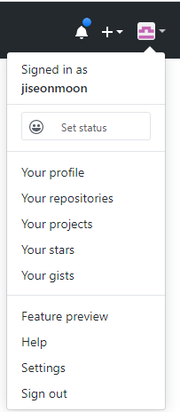
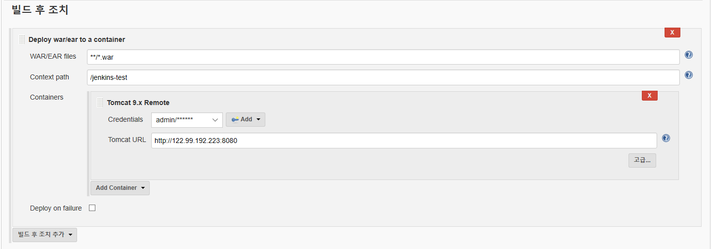
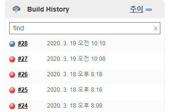

# Jenkins

## 1. 젠킨스란?

- 소프트웨어 개발 시 지속적 통합 서비스를 제공하는 툴(CI툴)

- **젠킨스를 사용하지 않을 경우**

  ```
  수정사항 Git에 push → 서버에서 pull → 빌드(jar파일로 떨굼) → 웹서버 restart
  ```

- **젠킨스를 사용할 경우**

  ```
  수정사항 Git에 push → 젠킨스에서 빌드 및 배포
  ```


## 2. 젠킨스 시작

### 2-1. 젠킨스 설치

1. https://jenkins.io/download/에서 Long-term Support (LTS) → Download Jenkins for → Windows

2. Next → Next → Install → Finish

3. 설치가 완료되면 Unlock Jenkins 화면이 나타남

   

4. Administrator password에 `C:\Program Files (x86)\Jenkins\secrets\initialAdminPassword` 파일의 내용을 입력 → Continue

5. Customize Jenkins 화면이 나타나면 Install suggested plugins

6. Create First Admin User 화면이 나타나면 Admin 계정을 생성 → Save and Continue

7. Instance Configuration 화면이 나타나면 Jenkins URL에 `http://IP 주소:9090/` 을 입력

### 2-3. 젠킨스 포트 번호 변경

1. `C:\Program Files (x86)\Jenkins\jenkins.xml` 파일에서 포트 번호를 8080번에서 9090번으로 변경

   ```
   <service>
   <arguments>-Xrs -Xmx256m -Dhudson.lifecycle=hudson.lifecycle.WindowsServiceLifecycle -jar "%BASE%\jenkins.war" --httpPort=9090 --webroot="%BASE%\war"</arguments>
   </service>
   ```

2. 서비스 → Jenkins → 다시 시작 


## 3. 젠킨스 추가 설정

1. `http://IP 주소:9090/` 에 접속

   

2. 로그인하면 메인 화면이 나타남

   

3. Jenkins 관리 → Global Tool Configuration

### 3-1. JDK 설정

1. Add JDK → Install autotmatically 선택 해제

2. Name에 새로운 이름을 입력

3. JAVA_HOME에 jdk 위치를 입력

   

### 3-2. Git 설정

1. Add Git → Install autotmatically 선택 해제

2. Name에 새로운 이름을 입력

3. Path to Git executable에 git 위치를 입력

   

### 3-3. Maven 설정

1. Add Maven → 메이븐은 설치하지 않았으므로  Install automatically 선택 → Name에 새로운 이름을 입력 → Version에 사용하고 싶은 메이븐 버전 선택

### 3-4. Tomcat에 Deploy하기 위한 플러그인 설치

1. Jenkins 관리 → 플러그인 관리 → 설치 가능
2. deploy to container를 검색해서 설치

### 3-5. Tomcat에 접근하기 위한 설정

1. `톰캣 위치\conf\tomcat-users.xml` 파일에서 사용자를 추가

   ```
   <tomcat-users xmlns="http://tomcat.apache.org/xml"
                 xmlns:xsi="http://www.w3.org/2001/XMLSchema-instance"
                 xsi:schemaLocation="http://tomcat.apache.org/xml tomcat-users.xsd"
                 version="1.0">
   <role rolename="manager"/>
   <role rolename="manager-gui"/>
   <role rolename="manager-script"/>
   <role rolename="manager-jmx"/>
   <role rolename="manager-status"/>
   <user username="사용자 이름" password="사용자 비밀번호" roles="manager,manager-gui,manager-script,manager-status,manager-jmx" />
   </tomcat-users>
   ```

2. `톰캣 위치\webapps\manager\META-INF\context.xml` 파일에서 주석 처리

   ```
   <Context antiResourceLocking="false" privileged="true" >
     <!--<Valve className="org.apache.catalina.valves.RemoteAddrValve"
            allow="127\.\d+\.\d+\.\d+|::1|0:0:0:0:0:0:0:1" />-->
   </Context>
   ```

3. 서비스 → 톰캣 → 다시 시작

### 3-6. GitHub 설정

1. https://github.com/ 에 로그인

   

2. Settings → Developer settings → Personal access tokens → Generate new token → 비밀번호 확인

3. New personal access token이 나타나면 repo, admin:repo_hook 선택 →  Generate token

   

4. 토큰 내용을 저장

5. Jenkins 관리 → 시스템 설정 → Add GitHub Server → Name에 새로운 이름을 입력 → Add

6. Kind에 Secret text → Secret에 토큰 내용을 입력 → ID에 새로운 Credentials 아이디 입력 → Add

7. Test connection → 연동 확인 → 저장


## 4. 작업 생성

1. 새로운 Item → Enter an item name에 새로운 작업 이름을 입력 → Freestyle project → OK

### 4-1. General 설정

1. General → GitHub project 선택 → Project url에 깃허브 프로젝트 주소를 입력

### 4-2. 소스 코드 관리 설정

1. 소스 코드 관리 → Git → Repository URL에 깃허브 프로젝트 주소.git을 입력 → Add
2. Username에 깃허브 계정 사용자 이름을 입력 → Password에 깃허브 계정 비밀번호를 입력 → ID에 새로운 Credentials 아이디 입력 → Add

### 4-3. 빌드 설정

1. Build → Invoke top-level Maven targets → Maven Version에 메이븐 설정 이름을 선택 → 고급... → 아래와 같이 입력

   

### 4-4. 빌드 후 조치 설정

1. 빌드 후 조치  Deploy war/ear to a container 선택 → Containers에 사용중인 톰캣 버전 선택 → Add → Username에 **3-5**에서 설정한 사용자 이름 입력 → Password에 **3-5**에서 설정한 사용자 비밀번호를 입력 → ID에 새로운 Credentials 아이디 입력 → Add

2. 아래와 같이 입력

   

3. 저장


## 5. 빌드 및 배포

### 5-1. 빌드 확인

1. Build Now → Build History에 빌드 번호를 선택해서 빌드 확인

   

### 5-2. 배포 확인

1.  `http://IP 주소:9090/컨텍스트 경로` 에 접속해서 배포 확인